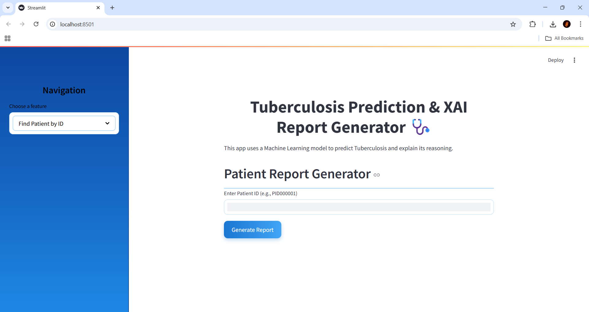
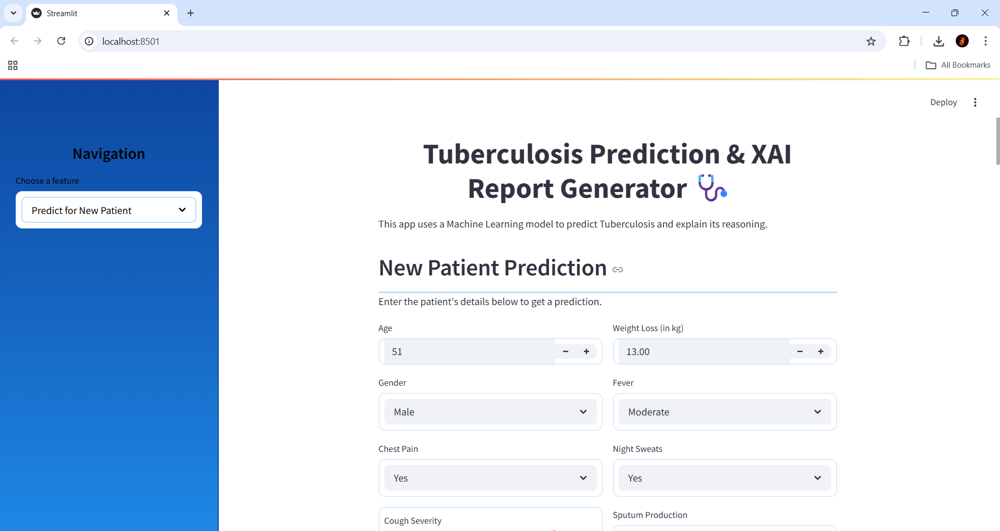

# 🩺 Tuberculosis Prediction using Machine Learning with XAI

This project is a Streamlit web application that predicts the likelihood of Tuberculosis (TB) based on clinical symptom data using a Random Forest model. It incorporates Explainable AI (XAI) by identifying key predictive factors and generates a human-readable report with risk analysis and visualizations.


 

 


## ✨ Features

* Predicts TB status (Normal/Tuberculosis) with confidence score.
* Identifies the Top 5 most important factors influencing the prediction.
* Provides a detailed text report including analysis of the patient's key factors and a risk assessment compared to average TB patient data.
* Visualizes key factor comparisons using Altair bar charts.
* Two modes: Predict for a new patient via form input, or look up an existing patient by ID.
* Uses a modified synthetic dataset (`tuberculosis_dataset.csv`) for demonstration purposes.

## 🚀 How to Run

1.  **Clone the repository:**
    ```bash
    git clone <your-repository-url>
    cd <your-repository-directory-name>
    ```
2.  **Install requirements:**
    ```bash
    pip install -r requirements.txt
    ```
3.  **Run the Streamlit app:**
    ```bash
    streamlit run main.py
    ```
4.  Open your web browser to the local URL provided by Streamlit.

## 📊 Dataset

The application uses `tuberculosis_dataset.csv`, a synthetically modified dataset based on an initial public dataset, adjusted to show clearer distinctions between classes for demonstration.

## 📚 Libraries Used

* Streamlit
* Pandas
* Scikit-learn
* Altair
* NumPy

## 🤝 Collaborators

* **[Shruti Patil](https://github.com/shruti182004)** 
